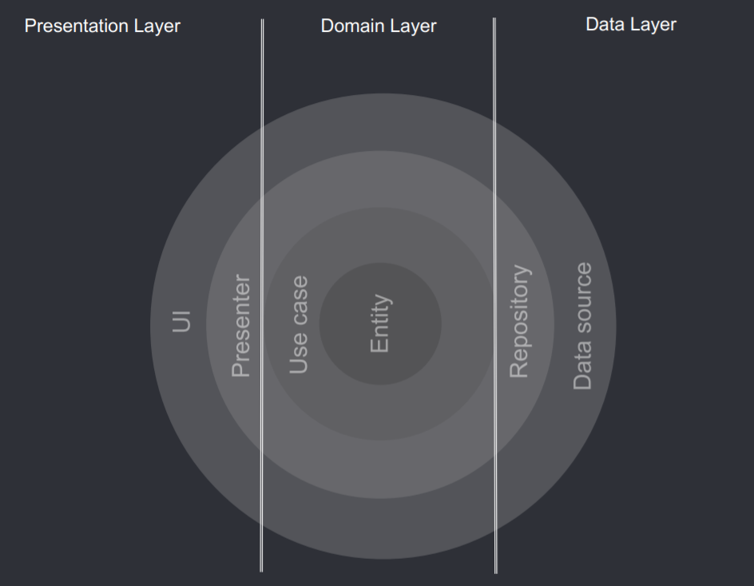

# Node - Clean Architecture Boilerplate

## Architecture

The folder structure tries to explicit the underlying architectural constraints.

We have tree main layers:

* Presentational (Interface & Adapters)
* Domain (Business Rules)
* Data (Drivers)

We use __Controllers__ 

### Presentational Layer

Refers to the two most external layers of the _Clean Architecture_, __Frameworks & Drivers__, and __Interface Adapters__.

In our case __Presenters/Views__, given we are working with a RESTful API for CRUD operations, refers to JSON data in the HTTP Responses from our `api/routes`.

__Gateways__/__Controllers__ are in `api/gateways` and `api/controllers` respectively.

#### Dependency Rule

Presentation Layer depends on Domain Layer.

### Domain Layer

This are the two most inner layers of the _Clean Architecture_, __Enterprise & Applicaiton Business Rules__.

__Use Cases__ and __Entities__ are defined in `use-cases` and `entities` respectively.

#### Dependency Rule

No dependencies with other layers. Following the Dependency Inversion Principle, they should rely on interfaces.

### Data Layer

Also refers to the two most external layers of _Clean Archecture_, but this is the layer that has access to the __Frameworks & Drivers__ responsible for retrieving and manipulating data.

Contains __Repository__ implementations and one or multiple __Data Sources__, in `repositories` and `sources` respectively.

#### Dependeny Rule

Data Layer depends on Domain Layer.

## Data Flow

1. HTTP request to our Presenter/View, delegates input to be handled by Middleware and Gateways (`api/routes`)
2. Middleware processes as needed, i.e authentication (`api/middlewares`)
3. Gateways (`api/gateways`) handle request input and calls needed Controller (`api/controllers`)
4. Controllers(`apiUse Cases (`domain/use-cases`).
4. Use Cases request needed data from Entities (`domain/entities`) and Repositories (`data/repositories`) (__IMPORTANT NOTE__)
4. Repositories request needed data from Data Sources (`data/sources`)
5. Information flows back to Use Cases and gets processed as needed
6. Information flows back to Gateways to handle Use Cases output
7. Processed information (Use Cases output) flows back to our Presenter/View and we send HTTP Response accordingly

From this, we can see how the user action flos from the UI all the way down to the Data Source and then flows back up. But in the middle of this flow, we have the Dependeny Inversion Principle:

#### Important Note about Flow of Control

Use Cases don't explicitly call a concrete repository. This would violate the Dependency Inversion Principle. The most importantt hing to remember is that __nothing in an inner circle can know anything at all about something in an outer circle__.

That's why we use Abstractions (Interfaces) in between a concrete Use Case and a concrete Repository.

Please pay attention to the __Flow of Control__ in the following image:

Note that __Presenter__ and __Controllers__ don't know about each other, this would limit the possibility to interchange them, a Controller should be able to work just fine with a different Presenter, and viceversa.

#### How we inject dependencies

We'll use our `index.js` whenever we need to inject dependencies to maintain the Dependency Inverson Principle. The main example here is `domain/use-cases/index.js` where we inject the needed Repositories for Use Cases to actually work. If needed, we could create a different approach for example if we have multiple data sources.